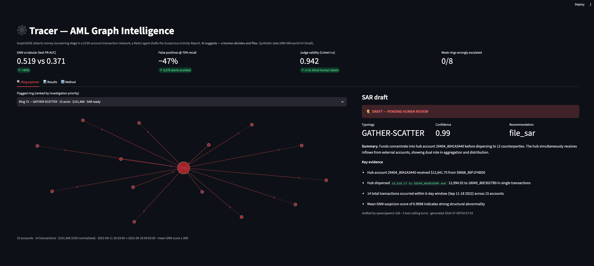
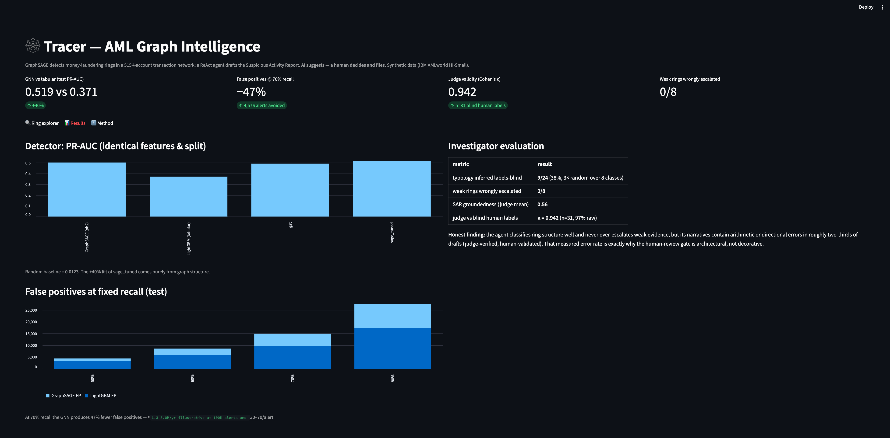

# Tracer — AML Graph Intelligence

**Graph neural networks that detect money-laundering rings in transaction networks — and an agentic investigator that drafts the case file, with every claim measured.**

   

**[Live demo](https://tracer-aml-graph-intelligence.streamlit.app)** · **[Code](https://github.com/hugocorreia123/tracer-aml-graph-intelligence)**

The demo is an **investigation console**: pick a flagged ring and its priority, suspicion, money flow and the agent's call follow instantly — with a plain-language tour, one-sentence metric explanations, and an honesty box built into the interface.

---

## Results

| Claim | Evidence |
|---|---|
| **Graph structure beats tabular ML at detecting laundering** | GraphSAGE test PR-AUC **0.519** vs LightGBM **0.371** (**+40%**) — identical features, identical split; the lift is attributable to the network alone |
| **47% fewer false positives at the same catch rate** | At 70% recall: 5,169 FP vs 9,745 FP on the test set — **4,576 wasted investigations avoided** (≈$1.3–3.0M/yr illustrative at 100K alerts, $30–70/alert) |
| **The AI investigator infers laundering typology from raw structure** | 8-way typology identified labels-blind at **3× random**; **0/8 weak rings wrongly escalated** to SAR filing |
| **SAR quality is measured, not asserted** | Factual groundedness scored by a cross-family LLM judge, **validated against blind human labels: Cohen's κ = 0.942** (n=31, 96.8% raw agreement) |
| **The human-review gate is justified by data** | Agent narratives contain arithmetic or directional errors in **~2/3 of drafts** (judge-verified, human-validated) — the measured reason review is architectural, not decorative |



## The problem

Rules-based AML inspects one transaction at a time and drowns analysts in noise: industry false-positive rates run **85–95%**, global AML compliance costs exceed **$270B a year**, and banks have paid **$45B+ in fines** since 2000. Real laundering, however, is a *network* — smurfing, layering, cycles, fan-in/fan-out across accounts. Per-transaction systems structurally cannot see a ring.

## The system

```
Transactions ──► Account–transaction GRAPH ──► GraphSAGE node scorer (PyG)
                                                     │  suspicion scores
                                                     ▼
                     Suspicious SUBGRAPHS → ≤60-account RINGS (recursive Louvain)
                                                     │
                                                     ▼
                     ReAct INVESTIGATOR (LangGraph + Groq): evidence tools →
                     typology inference → SAR draft + confidence + recommendation
                                                     │
                                                     ▼
                     HUMAN REVIEW · AI suggests — a human decides and files
```

1. **Detect.** 5.08M synthetic bank transactions (IBM AMLworld HI-Small) become a **515,088-account directed graph**; a 3-layer GraphSAGE scores every account. Thresholded at the 70%-recall operating point.
2. **Extract.** Flagged accounts are grouped into suspicious subgraphs and recursively decomposed (Louvain) into **3,058 investigable rings (≤60 accounts)** with structural motifs — cycles, fan-in/out hubs, gather-scatter hubs.
3. **Investigate.** A ReAct agent (qwen3-32b) queries each ring through evidence tools — flows, degree structure, account profiles; **typology labels are withheld** — and drafts a Suspicious Activity Report: typology, confidence, key evidence, recommendation (`file_sar` / `monitor` / `dismiss`).
4. **Review.** Every draft is stamped **PENDING HUMAN REVIEW**. The measured error rate (below) is why.

## Demo

The interactive ring explorer: pick a flagged ring, see the money move, read the drafted SAR.



A laundering **CYCLE** hiding in ordinary traffic — the thing per-transaction systems structurally cannot see:


## Evaluation

**Detector — controlled comparison.** One fixed stratified split (60/20/20 by account, seed 42) is shared by every model. The LightGBM baseline gets the same 26 behavioral features as the GNN, so the only variable is graph structure.

| model | test PR-AUC | note |
|---|---|---|
| random | 0.012 | 1.23% illicit accounts |
| LightGBM (tabular) | 0.371 | honest, tuned control |
| GraphSAGE, 2-layer | 0.503 | +36% |
| **GraphSAGE, 3-layer tuned** | **0.519** | **+40% — champion** |
| GATv2 | 0.492 | negative result: attention underperformed at 2× compute |

**Operating point.** At every recall level 50–80%, the GNN needs roughly half the alerts of the baseline. At 70% recall it cuts false positives **47%**.

**Ring extraction vs ground truth.** Rings cover **60.3%** of the 370 labeled laundering attempts at investigable granularity (86.5% at raw component level — a measured coverage/investigability tradeoff). Cycles and fan patterns are well covered; diffuse STACK/BIPARTITE structures are the blind spot.

**Investigator.** On a stratified eval set (24 ground-truth-matched rings across all 8 typologies + 8 weak controls): typology inferred labels-blind at **3× random**; errors concentrate in structurally adjacent pairs (SCATTER-GATHER ↔ GATHER-SCATTER); **0/8 weak rings wrongly escalated**. SAR factual groundedness (mean **0.565**) was scored by a cross-family judge (gpt-oss-120b auditing qwen3-32b — no self-preference) and the judge itself validated against **blind human labels: κ = 0.942**. The dominant failure mode is precise: correct structural reasoning, unreliable arithmetic and occasional direction flips in narratives — quantified justification for the human gate.

## Key findings

1. **Network structure is real signal:** +40% PR-AUC over an identical-feature tabular model — the entire lift comes from the graph.
2. **Ranking beats reweighting:** class weighting *hurt* PR-AUC for LightGBM (collapsed to a 1-tree model) and was tuned down for the GNN.
3. **Attention was not worth it here:** GATv2 lost to tuned GraphSAGE at double the compute — measured, reported.
4. **Investigability costs coverage:** forcing rings to SAR-able size (≤60 accounts) drops attempt coverage from 86.5% to 60.3%, concentrated in diffuse typologies.
5. **LLM investigators reason well and calculate badly:** structure inferred at 3× random with zero over-escalation, but ~2/3 of narratives contain factual slips — the strongest argument for human-in-the-loop, backed by a κ=0.94-validated measurement.

## Stack

Python 3.11 · PyTorch + **PyTorch Geometric** (GraphSAGE, GATv2) · LightGBM · networkx · **LangGraph** + Groq (qwen3-32b agent, gpt-oss-120b judge) · FastAPI · Streamlit + Plotly · uv · Streamlit Community Cloud

## Reproduce

```bash
git clone https://github.com/hugocorreia123/tracer-aml-graph-intelligence
cd tracer-aml-graph-intelligence && uv sync

# data (Kaggle API token required)
uv run kaggle datasets download ealtman2019/ibm-transactions-for-anti-money-laundering-aml -f HI-Small_Trans.csv -p data/raw
uv run kaggle datasets download ealtman2019/ibm-transactions-for-anti-money-laundering-aml -f HI-Small_Patterns.txt -p data/raw
uv run kaggle datasets download ealtman2019/ibm-transactions-for-anti-money-laundering-aml -f HI-Small_accounts.csv -p data/raw

uv run python scripts/build_graph.py        # graph + typology ground truth
uv run python scripts/make_features.py      # features + canonical split
uv run python scripts/train_baseline.py     # LightGBM control (PR-AUC 0.371)
uv run python scripts/build_pyg_graph.py    # PyG tensor
uv run python scripts/train_v2.py --name sage_tuned --arch sage --layers 3 --hidden 256 --lr 3e-3 --pos-weight 5
uv run python scripts/operating_point.py    # FP reduction @ fixed recall
uv run python scripts/extract_rings.py      # 3,058 rings + motifs
uv run python scripts/investigate.py --top 5   # agentic SARs (GROQ_API_KEY)
uv run python scripts/eval_investigator.py  # typology accuracy
uv run python scripts/judge_sars.py         # groundedness judge
uv run python scripts/label_sars.py         # blind labels + Cohen's kappa
uv run streamlit run app.py                 # demo
```

## Scope & limitations

Synthetic data (no real customer data — by design); single training seed (multi-seed variance is future work); ring decomposition trades coverage of diffuse typologies for investigability; FX normalization uses fixed approximate 2022 rates; the illustrative ROI scaling assumes the test-set FP-reduction rate transfers.

## Related work

Tracer is the **network-level** counterpart to [Sentinel](https://github.com/hugocorreia123/sentinel-fraud-mlops) (transaction-level fraud MLOps: MLflow, shadow A/B, Prometheus/Grafana) and reuses the judge-validation methodology from [Voyager](https://github.com/hugocorreia123/voyager) (agent-topology evaluation, κ = 0.95). Together they form a financial-crime detection portfolio spanning transaction, network, and agentic layers.

---

**Hugo Correia** — Data Scientist / ML & AI Engineer, Lisbon · [LinkedIn](https://www.linkedin.com/in/hugogncorreia) · [GitHub](https://github.com/hugocorreia123)
