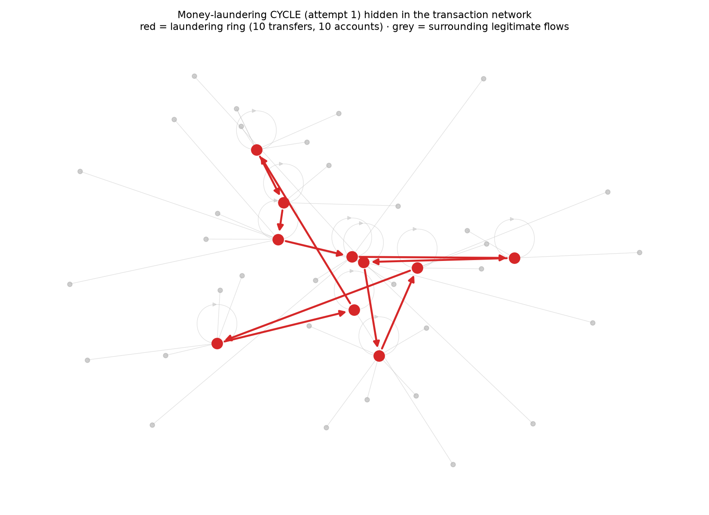

# Tracer — AML Graph Intelligence

**Graph neural networks that detect money-laundering *rings* in transaction networks, plus an agentic investigator that drafts the case file.**

  

> 🚧 **Work in progress** — built in public, phase by phase. Numbers below are verified as of Phase 0; findings land as each phase ships.

---

## Why

Rules-based AML looks at one transaction at a time — and drowns analysts in noise: industry false-positive rates run **85–95%**, and global AML compliance costs exceed **$270B a year**. But real laundering is a *network*: smurfing, layering, cycles, fan-in/fan-out between accounts. Per-transaction systems structurally cannot see a ring.

**Tracer attacks both halves of the problem:**

1. A **graph neural network** scores accounts inside the transaction *graph* and surfaces laundering **rings**, not isolated alerts.
2. An **agentic investigator** (LLM + graph tools) takes each flagged ring, identifies the laundering *typology*, and drafts the **Suspicious Activity Report** — with a human-in-the-loop gate. *AI suggests; the human decides and files.*

This is a laundering **CYCLE** hiding inside ordinary traffic — the thing Tracer exists to find:



## Data

[IBM AMLworld](https://www.kaggle.com/datasets/ealtman2019/ibm-transactions-for-anti-money-laundering-aml) (HI-Small split) — **synthetic** bank transactions with labeled laundering patterns. No real customer data.

Verified Phase 0 numbers:

| | |
|---|---|
| Transactions | 5,078,345 over 18 days |
| Accounts (graph nodes) | 515,088 — node ID = *(bank, account)* composite |
| Unique directed edges | 1,015,736 (72% in one weakly-connected component) |
| Illicit transactions | 5,177 (**0.10%**) |
| Illicit accounts | 6,357 (**1.23%**) |
| Labeled laundering attempts | **370**, across all **8 typologies** (cycle, fan-in, fan-out, gather-scatter, scatter-gather, bipartite, stack, random) |
| Ground-truth join | patterns ↔ transactions: **3,170 / 3,170 accounts (100%)** |

## Architecture

```
Transactions ──► Account–transaction GRAPH ──► GNN node scorer (PyG)
                                                    │ suspicion scores
                                                    ▼
                    Suspicious SUBGRAPHS (rings) + typology motifs
                                                    │
                                                    ▼
                    Agentic INVESTIGATOR (LangGraph): evidence → typology → SAR draft
                                                    │
                                                    ▼
                    Human review  ·  AI suggests, human decides & files
```

**Stack:** Python · PyTorch + PyTorch Geometric · networkx · LightGBM (baseline) · LangGraph + Groq · FastAPI · Streamlit + Plotly · Docker · HF Spaces

## Roadmap

- [x] **Phase 0 — Data + graph**: HI-Small pipeline, composite node IDs, 8-typology pattern parsing (100% ground-truth join), graph stats, first ring visualization
- [x] **Phase 1 — Tabular baseline**: per-account features → LightGBM, PR-AUC (the honest control the GNN must beat) — **test PR-AUC 0.371**
- [x] **Phase 2 — First GNN**: GraphSAGE node classifier vs. baseline on the same split — **test PR-AUC 0.503 (+36% over baseline)**
- [x] **Phase 3 — Stronger detector**: tuned 3-layer GraphSAGE — **test PR-AUC 0.519 (+40% vs tabular)**; GATv2 tried and *underperformed* (0.492 at 2× the compute); **47% fewer false positives at 70% recall** (≈$1.3–3.0M/yr illustrative at 100K alerts)
- [ ] **Phase 4 — Ring extraction**: flagged subgraphs + typology motif detection
- [ ] **Phase 5 — Agentic SAR investigator**: LangGraph agent drafts judge-checkable SARs
- [ ] **Phase 6 — Evaluation**: detection metrics per typology; SAR quality via cross-family LLM-as-judge validated against blind human labels (Cohen's κ)
- [ ] **Phase 7 — Serving + monitoring**: FastAPI scoring, drift/volume monitoring
- [ ] **Phase 8 — Demo**: interactive ring explorer + SAR panel on HF Spaces
- [ ] **Phase 9 — Findings-first README**

## Reproduce Phase 0

```bash
git clone https://github.com/hugocorreia123/tracer-aml-graph-intelligence
cd tracer-aml-graph-intelligence
uv sync
# Kaggle API token required (~/.kaggle/kaggle.json), then download HI-Small files to data/raw/
uv run kaggle datasets download ealtman2019/ibm-transactions-for-anti-money-laundering-aml -f HI-Small_Trans.csv -p data/raw
uv run kaggle datasets download ealtman2019/ibm-transactions-for-anti-money-laundering-aml -f HI-Small_Patterns.txt -p data/raw
uv run kaggle datasets download ealtman2019/ibm-transactions-for-anti-money-laundering-aml -f HI-Small_accounts.csv -p data/raw
uv run python scripts/build_graph.py
uv run python scripts/visualize_ring.py
```

## Related work by me

Tracer is the network-level counterpart to [**Sentinel**](https://github.com/hugocorreia123/sentinel-fraud-mlops) (transaction-level fraud MLOps) and reuses the judge-validation methodology from [**Voyager**](https://github.com/hugocorreia123/voyager) (agent evaluation, Cohen's κ = 0.95).

---

*Hugo Correia — [LinkedIn](https://www.linkedin.com/in/hugogncorreia) · Data Scientist / ML & AI Engineer, Lisbon*
